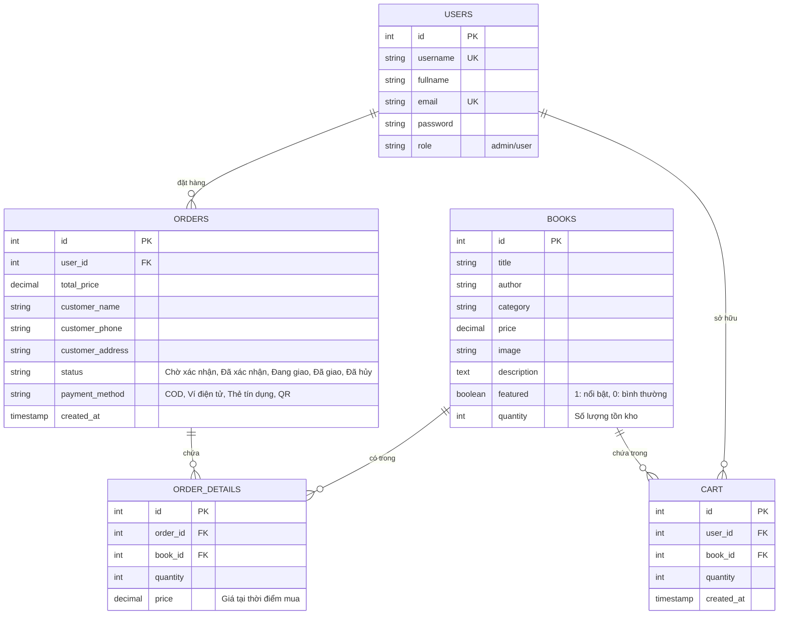

# Thiết kế Cơ sở dữ liệu - Website bán sách online

Tài liệu này trình bày chi tiết về thiết kế Cơ sở dữ liệu (Database Schema) cho dự án **Website bán sách online**, phục vụ việc báo cáo đề tài.

---

## 1. Sơ đồ quan hệ thực thể (ERD)

Dưới đây là sơ đồ quan hệ giữa các bảng trong hệ thống:



---

## 2. Mô tả chi tiết các bảng CSDL

### 2.1 Bảng `users` (Quản lý người dùng và Quản trị viên)
Lưu trữ thông tin tài khoản đăng nhập của Khách hàng và Admin.

| Tên trường | Kiểu dữ liệu | Ràng buộc | Mô tả |
| :--- | :--- | :--- | :--- |
| `id` | INT | Primary Key, Auto Increment | Mã định danh người dùng |
| `username` | VARCHAR(50) | NOT NULL, UNIQUE | Tên đăng nhập tài khoản |
| `fullname` | VARCHAR(100) | NOT NULL | Họ và tên đầy đủ |
| `email` | VARCHAR(100) | NOT NULL, UNIQUE | Địa chỉ email |
| `password` | VARCHAR(255) | NOT NULL | Mật khẩu (đã mã hóa MD5 hoặc băm password_hash) |
| `role` | ENUM('user', 'admin') | DEFAULT 'user' | Quyền hạn: `admin` hoặc `user` |

### 2.2 Bảng `books` (Quản lý danh sách sách)
Lưu trữ thông tin về các cuốn sách có trong cửa hàng.

| Tên trường | Kiểu dữ liệu | Ràng buộc | Mô tả |
| :--- | :--- | :--- | :--- |
| `id` | INT | Primary Key, Auto Increment | Mã định danh cuốn sách |
| `title` | VARCHAR(255) | NOT NULL | Tên sách |
| `author` | VARCHAR(150) | NOT NULL | Tác giả |
| `category` | VARCHAR(100) | NOT NULL | Thể loại sách (Ví dụ: Văn học, Công nghệ, Kỹ năng,...) |
| `price` | DECIMAL(10, 2) | NOT NULL | Giá bán (VND) |
| `image` | VARCHAR(255) | DEFAULT NULL | Tên tệp tin ảnh hoặc URL ảnh bìa |
| `description` | TEXT | DEFAULT NULL | Mô tả tóm tắt nội dung cuốn sách |
| `featured` | TINYINT(1) | DEFAULT 0 | Trạng thái nổi bật: `1` là sách nổi bật, `0` là thường |
| `quantity` | INT | DEFAULT 10 | Số lượng sách trong kho |

### 2.3 Bảng `orders` (Quản lý đơn hàng tổng quát)
Lưu trữ thông tin về các đơn đặt hàng đã thực hiện.

| Tên trường | Kiểu dữ liệu | Ràng buộc | Mô tả |
| :--- | :--- | :--- | :--- |
| `id` | INT | Primary Key, Auto Increment | Mã định danh đơn hàng |
| `user_id` | INT | Foreign Key -> `users.id` (ON DELETE CASCADE) | Người dùng thực hiện đặt hàng |
| `total_price` | DECIMAL(10, 2) | NOT NULL | Tổng giá trị đơn hàng |
| `customer_name` | VARCHAR(100) | NOT NULL | Họ tên người nhận hàng |
| `customer_phone` | VARCHAR(15) | NOT NULL | Số điện thoại nhận hàng |
| `customer_address` | TEXT | NOT NULL | Địa chỉ giao nhận hàng |
| `status` | VARCHAR(50) | NOT NULL DEFAULT 'Chờ xác nhận' | Trạng thái: Chờ xác nhận, Đã xác nhận, Đang giao, Đã giao, Đã hủy |
| `payment_method` | VARCHAR(50) | NOT NULL DEFAULT 'COD' | Phương thức thanh toán: COD, Ví điện tử, Thẻ tín dụng, QR |
| `created_at` | TIMESTAMP | DEFAULT CURRENT_TIMESTAMP | Thời gian tạo đơn hàng |

### 2.4 Bảng `order_details` (Chi tiết các mặt hàng trong đơn hàng)
Lưu thông tin các cuốn sách cụ thể cùng số lượng và đơn giá trong mỗi đơn hàng.

| Tên trường | Kiểu dữ liệu | Ràng buộc | Mô tả |
| :--- | :--- | :--- | :--- |
| `id` | INT | Primary Key, Auto Increment | Mã định danh chi tiết |
| `order_id` | INT | Foreign Key -> `orders.id` (ON DELETE CASCADE) | Mã đơn hàng tương ứng |
| `book_id` | INT | Foreign Key -> `books.id` (ON DELETE CASCADE) | Mã sách được mua |
| `quantity` | INT | NOT NULL | Số lượng sách mua |
| `price` | DECIMAL(10, 2) | NOT NULL | Giá của sách tại thời điểm đặt mua |

### 2.5 Bảng `cart` (Giỏ hàng cá nhân lưu trong DB cho user đã đăng nhập)
Lưu giữ trạng thái giỏ hàng khi người dùng đăng nhập để đồng bộ giữa các phiên làm việc.

| Tên trường | Kiểu dữ liệu | Ràng buộc | Mô tả |
| :--- | :--- | :--- | :--- |
| `id` | INT | Primary Key, Auto Increment | Mã định danh bản ghi giỏ hàng |
| `user_id` | INT | Foreign Key -> `users.id` (ON DELETE CASCADE) | ID người dùng |
| `book_id` | INT | Foreign Key -> `books.id` (ON DELETE CASCADE) | ID cuốn sách trong giỏ |
| `quantity` | INT | DEFAULT 1 | Số lượng sách chọn mua |
| `created_at` | TIMESTAMP | DEFAULT CURRENT_TIMESTAMP | Thời gian thêm vào giỏ |

---

## 3. Câu lệnh SQL tạo cấu trúc bảng (DDL)

```sql
DROP DATABASE IF EXISTS ban_sach_online;
CREATE DATABASE IF NOT EXISTS ban_sach_online CHARACTER SET utf8mb4 COLLATE utf8mb4_unicode_ci;
USE ban_sach_online;

-- 1. Tạo bảng users
CREATE TABLE users (
    id INT AUTO_INCREMENT PRIMARY KEY,
    username VARCHAR(50) NOT NULL UNIQUE,
    fullname VARCHAR(100) NOT NULL,
    email VARCHAR(100) NOT NULL UNIQUE,
    password VARCHAR(255) NOT NULL,
    role ENUM('user', 'admin') DEFAULT 'user'
);

-- 2. Tạo bảng books
CREATE TABLE books (
    id INT AUTO_INCREMENT PRIMARY KEY,
    title VARCHAR(255) NOT NULL,
    author VARCHAR(150) NOT NULL,
    category VARCHAR(100) NOT NULL,
    price DECIMAL(10, 2) NOT NULL,
    image VARCHAR(255),
    description TEXT,
    featured TINYINT(1) DEFAULT 0,
    quantity INT DEFAULT 10
);

-- 3. Tạo bảng orders
CREATE TABLE orders (
    id INT AUTO_INCREMENT PRIMARY KEY,
    user_id INT NOT NULL,
    total_price DECIMAL(10, 2) NOT NULL,
    customer_name VARCHAR(100) NOT NULL,
    customer_phone VARCHAR(15) NOT NULL,
    customer_address TEXT NOT NULL,
    status VARCHAR(50) NOT NULL DEFAULT 'Chờ xác nhận',
    payment_method VARCHAR(50) NOT NULL DEFAULT 'COD',
    created_at TIMESTAMP DEFAULT CURRENT_TIMESTAMP,
    FOREIGN KEY (user_id) REFERENCES users(id) ON DELETE CASCADE
);

-- 4. Tạo bảng order_details
CREATE TABLE order_details (
    id INT AUTO_INCREMENT PRIMARY KEY,
    order_id INT NOT NULL,
    book_id INT NOT NULL,
    quantity INT NOT NULL,
    price DECIMAL(10, 2) NOT NULL, 
    FOREIGN KEY (order_id) REFERENCES orders(id) ON DELETE CASCADE,
    FOREIGN KEY (book_id) REFERENCES books(id) ON DELETE CASCADE
);

-- 5. Tạo bảng cart
CREATE TABLE cart (
    id INT AUTO_INCREMENT PRIMARY KEY,
    user_id INT NOT NULL,
    book_id INT NOT NULL,
    quantity INT DEFAULT 1,
    created_at TIMESTAMP DEFAULT CURRENT_TIMESTAMP,
    FOREIGN KEY (user_id) REFERENCES users(id) ON DELETE CASCADE,
    FOREIGN KEY (book_id) REFERENCES books(id) ON DELETE CASCADE
);
```

---

## 4. Dữ liệu mẫu khởi tạo (Seed Data)

Dưới đây là tập lệnh SQL để chèn các dữ liệu mẫu nhằm mục đích demo chạy ứng dụng:

```sql
-- Dữ liệu mẫu bảng users (Mật khẩu đều là '123456' đã mã hóa MD5: e10adc3949ba59abbe56e057f20f883e)
INSERT INTO users (username, fullname, email, password, role) VALUES
('admin', 'Quản Trị Viên', 'admin@gmail.com', 'e10adc3949ba59abbe56e057f20f883e', 'admin'),
('nguyenvana', 'Nguyễn Văn A', 'nguyenvana@gmail.com', 'e10adc3949ba59abbe56e057f20f883e', 'user'),
('tranthib', 'Trần Thị B', 'tranthib@gmail.com', 'e10adc3949ba59abbe56e057f20f883e', 'user'),
('lehoangc', 'Lê Hoàng C', 'lehoangc@gmail.com', 'e10adc3949ba59abbe56e057f20f883e', 'user');

-- Dữ liệu mẫu bảng books
INSERT INTO books (title, author, category, price, image, description, featured, quantity) VALUES
('Đắc Nhân Tâm', 'Dale Carnegie', 'Tâm lý - Kỹ năng sống', 85000.00, 'dac_nhan_tam.jpg', 'Cuốn sách nghệ thuật thu phục lòng người.', 1, 15),
('Nhà Giả Kim', 'Paulo Coelho', 'Tiểu thuyết', 79000.00, 'nha_gia_kim.jpg', 'Hành trình đi tìm vận mệnh của cậu bé chăn cừu.', 1, 20),
('Clean Code', 'Robert C. Martin', 'Công nghệ thông tin', 250000.00, 'clean_code.jpg', 'Sách hướng dẫn viết mã sạch cho lập trình viên.', 1, 5),
('Lập Trình PHP Căn Bản', 'ThS. Nguyễn Trung Trí', 'Công nghệ thông tin', 150000.00, 'php_can_ban.jpg', 'Tài liệu hướng dẫn thiết kế website với PHP & MySQL dành cho sinh viên.', 0, 12),
('Tuổi Trẻ Đáng Giá Bao Nhiêu', 'Rosie Nguyễn', 'Tâm lý - Kỹ năng sống', 80000.00, 'tuoi_tre.jpg', 'Sách truyền cảm hứng cho giới trẻ về việc học tập, làm việc và trải nghiệm.', 0, 8),
('Tôi Thấy Hoa Vàng Trên Cỏ Xanh', 'Nguyễn Nhật Ánh', 'Tiểu thuyết', 95000.00, 'hoa_vang_co_xanh.jpg', 'Câu chuyện tuổi thơ đầy xúc động và ý nghĩa tại một làng quê nghèo.', 0, 10),
('Thiết Kế Web Với HTML, CSS & JS', 'Jon Duckett', 'Công nghệ thông tin', 220000.00, 'html_css_js.jpg', 'Cuốn sách trực quan và dễ hiểu nhất để học thiết kế giao diện website.', 0, 6),
('Tư Duy Nhanh Và Chậm', 'Daniel Kahneman', 'Tâm lý học', 185000.00, 'tu_duy_nhanh_cham.jpg', 'Khám phá hai hệ thống tư duy chi phối mọi quyết định của con người.', 0, 14);

-- Thêm Giỏ hàng mẫu cho Nguyễn Văn A (user_id = 2) đang chọn mua 2 sách
INSERT INTO cart (user_id, book_id, quantity) VALUES
(2, 4, 1),
(2, 1, 2);

-- Thêm Đơn hàng mẫu cho Trần Thị B (user_id = 3) đã thanh toán xong
INSERT INTO orders (user_id, total_price, customer_name, customer_phone, customer_address, status, payment_method, created_at) VALUES
(3, 329000.00, 'Trần Thị B', '0912345678', '123 Đường Nguyễn Trãi, Quận 1, TP. Hồ Chí Minh', 'Đã giao', 'Ví điện tử', '2024-05-15 10:30:00');

-- Thêm Chi tiết cho Đơn hàng trên (order_id = 1)
INSERT INTO order_details (order_id, book_id, quantity, price) VALUES
(1, 3, 1, 250000.00),
(1, 2, 1, 79000.00);
```
