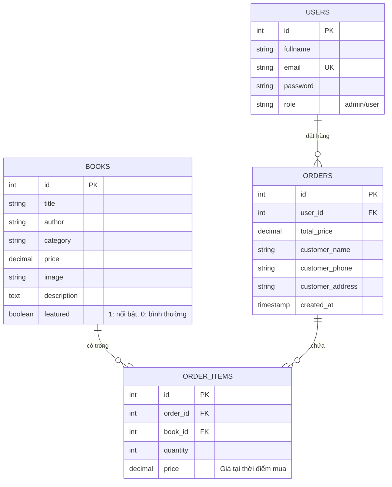

# Thiết kế Cơ sở dữ liệu - Website bán sách online

Tài liệu này trình bày chi tiết về thiết kế Cơ sở dữ liệu (Database Schema) cho dự án **Website bán sách online**, phục vụ việc báo cáo đề tài.

---

## 1. Sơ đồ quan hệ thực thể (ERD)

Dưới đây là sơ đồ quan hệ giữa các bảng trong hệ thống:



---

## 2. Mô tả chi tiết các bảng CSDL

### 2.1 Bảng `users` (Quản lý người dùng và Quản trị viên)
Lưu trữ thông tin tài khoản đăng nhập của Khách hàng và Admin.

| Tên trường | Kiểu dữ liệu | Ràng buộc | Mô tả |
| :--- | :--- | :--- | :--- |
| `id` | INT | Primary Key, Auto Increment | Mã định danh người dùng |
| `fullname` | VARCHAR(100) | NOT NULL | Họ và tên đầy đủ |
| `email` | VARCHAR(100) | NOT NULL, UNIQUE | Địa chỉ email (Dùng làm tên đăng nhập) |
| `password` | VARCHAR(255) | NOT NULL | Mật khẩu (được mã hóa hash `password_hash()`) |
| `role` | VARCHAR(10) | NOT NULL, DEFAULT 'user' | Quyền hạn: `admin` hoặc `user` |

### 2.2 Bảng `books` (Quản lý danh sách sách)
Lưu trữ thông tin về các cuốn sách có trong cửa hàng.

| Tên trường | Kiểu dữ liệu | Ràng buộc | Mô tả |
| :--- | :--- | :--- | :--- |
| `id` | INT | Primary Key, Auto Increment | Mã định danh cuốn sách |
| `title` | VARCHAR(255) | NOT NULL | Tên sách |
| `author` | VARCHAR(150) | NOT NULL | Tác giả |
| `category` | VARCHAR(100) | NOT NULL | Thể loại sách (Ví dụ: Văn học, Công nghệ, Kỹ năng,...) |
| `price` | DECIMAL(10, 2) | NOT NULL, >= 0 | Giá bán (VND) |
| `image` | VARCHAR(255) | DEFAULT NULL | Tên tệp tin ảnh hoặc URL ảnh bìa |
| `description` | TEXT | DEFAULT NULL | Mô tả tóm tắt nội dung cuốn sách |
| `featured` | TINYINT(1) | DEFAULT 0 | Trạng thái nổi bật: `1` là sách nổi bật, `0` là thường |

### 2.3 Bảng `orders` (Quản lý đơn hàng tổng quát)
Lưu trữ thông tin về các đơn đặt hàng đã thực hiện.

| Tên trường | Kiểu dữ liệu | Ràng buộc | Mô tả |
| :--- | :--- | :--- | :--- |
| `id` | INT | Primary Key, Auto Increment | Mã định danh đơn hàng |
| `user_id` | INT | Foreign Key -> `users.id` | Người dùng thực hiện đặt hàng (NULL nếu là khách vãng lai) |
| `total_price` | DECIMAL(10, 2) | NOT NULL | Tổng giá trị đơn hàng |
| `customer_name` | VARCHAR(100) | NOT NULL | Họ tên người nhận hàng |
| `customer_phone` | VARCHAR(15) | NOT NULL | Số điện thoại nhận hàng |
| `customer_address` | TEXT | NOT NULL | Địa chỉ giao nhận hàng |
| `created_at` | TIMESTAMP | DEFAULT CURRENT_TIMESTAMP | Thời gian tạo đơn hàng |

### 2.4 Bảng `order_items` (Chi tiết các mặt hàng trong đơn hàng)
Lưu thông tin các cuốn sách cụ thể cùng số lượng và đơn giá trong mỗi đơn hàng.

| Tên trường | Kiểu dữ liệu | Ràng buộc | Mô tả |
| :--- | :--- | :--- | :--- |
| `id` | INT | Primary Key, Auto Increment | Mã định danh chi tiết |
| `order_id` | INT | Foreign Key -> `orders.id` (ON DELETE CASCADE) | Mã đơn hàng tương ứng |
| `book_id` | INT | Foreign Key -> `books.id` (ON DELETE SET NULL) | Mã sách được mua |
| `quantity` | INT | NOT NULL, > 0 | Số lượng sách mua |
| `price` | DECIMAL(10, 2) | NOT NULL | Giá của sách tại thời điểm đặt mua |

---

## 3. Câu lệnh SQL tạo cấu trúc bảng (DDL)

```sql
CREATE DATABASE IF NOT EXISTS bookstore_db CHARACTER SET utf8mb4 COLLATE utf8mb4_unicode_ci;
USE bookstore_db;

-- 1. Tạo bảng users
CREATE TABLE `users` (
  `id` INT AUTO_INCREMENT PRIMARY KEY,
  `fullname` VARCHAR(100) NOT NULL,
  `email` VARCHAR(100) NOT NULL UNIQUE,
  `password` VARCHAR(255) NOT NULL,
  `role` VARCHAR(10) NOT NULL DEFAULT 'user'
) ENGINE=InnoDB DEFAULT CHARSET=utf8mb4;

-- 2. Tạo bảng books
CREATE TABLE `books` (
  `id` INT AUTO_INCREMENT PRIMARY KEY,
  `title` VARCHAR(255) NOT NULL,
  `author` VARCHAR(150) NOT NULL,
  `category` VARCHAR(100) NOT NULL,
  `price` DECIMAL(10, 2) NOT NULL CHECK (`price` >= 0),
  `image` VARCHAR(255) DEFAULT NULL,
  `description` TEXT DEFAULT NULL,
  `featured` TINYINT(1) DEFAULT 0
) ENGINE=InnoDB DEFAULT CHARSET=utf8mb4;

-- 3. Tạo bảng orders
CREATE TABLE `orders` (
  `id` INT AUTO_INCREMENT PRIMARY KEY,
  `user_id` INT DEFAULT NULL,
  `total_price` DECIMAL(10, 2) NOT NULL,
  `customer_name` VARCHAR(100) NOT NULL,
  `customer_phone` VARCHAR(15) NOT NULL,
  `customer_address` TEXT NOT NULL,
  `created_at` TIMESTAMP DEFAULT CURRENT_TIMESTAMP,
  FOREIGN KEY (`user_id`) REFERENCES `users`(`id`) ON DELETE SET NULL
) ENGINE=InnoDB DEFAULT CHARSET=utf8mb4;

-- 4. Tạo bảng order_items
CREATE TABLE `order_items` (
  `id` INT AUTO_INCREMENT PRIMARY KEY,
  `order_id` INT NOT NULL,
  `book_id` INT DEFAULT NULL,
  `quantity` INT NOT NULL CHECK (`quantity` > 0),
  `price` DECIMAL(10, 2) NOT NULL,
  FOREIGN KEY (`order_id`) REFERENCES `orders`(`id`) ON DELETE CASCADE,
  FOREIGN KEY (`book_id`) REFERENCES `books`(`id`) ON DELETE SET NULL
) ENGINE=InnoDB DEFAULT CHARSET=utf8mb4;
```

---

## 4. Dữ liệu mẫu khởi tạo (Seed Data)

Dưới đây là tập lệnh SQL để chèn các dữ liệu mẫu nhằm mục đích demo chạy ứng dụng:

```sql
-- Dữ liệu mẫu bảng users (Mật khẩu băm của 'admin123' và 'user123' tương ứng)
-- Mật khẩu mẫu: 
-- admin@bookstore.com -> admin123 (Mã băm: $2y$10$l1VnfR43H1h/jsRmi9jxr.5kJIf4PTvyF3LoPhewTGm/lquiew/ma)
-- customer@example.com -> user123 (Mã băm: $2y$10$dktO2PmjAVu5aRCkIB.DEeJWxPCNTbRq8H0AmA4qnsgYhKTeYVe/K)

INSERT INTO `users` (`fullname`, `email`, `password`, `role`) VALUES
('Quản trị viên', 'admin@bookstore.com', '$2y$10$l1VnfR43H1h/jsRmi9jxr.5kJIf4PTvyF3LoPhewTGm/lquiew/ma', 'admin'),
('Nguyễn Văn Khách', 'customer@example.com', '$2y$10$dktO2PmjAVu5aRCkIB.DEeJWxPCNTbRq8H0AmA4qnsgYhKTeYVe/K', 'user');

-- Dữ liệu mẫu bảng books
INSERT INTO `books` (`title`, `author`, `category`, `price`, `image`, `description`, `featured`) VALUES
('Đắc Nhân Tâm', 'Dale Carnegie', 'Kỹ năng sống', 86000.00, 'dac_nhan_tam.jpg', 'Cuốn sách đưa ra các lời khuyên về cách thức cư xử, ứng xử và giao tiếp với mọi người để đạt được thành công trong cuộc sống.', 1),
('Nhà Giả Kim', 'Paulo Coelho', 'Tiểu thuyết', 79000.00, 'nha_gia_kim.jpg', 'Câu chuyện kể về hành trình đầy sóng gió và chiêm nghiệm của cậu bé chăn cừu Santiago đi tìm kho báu của đời mình.', 1),
('Tôi Thấy Hoa Vàng Trên Cỏ Xanh', 'Nguyễn Nhật Ánh', 'Văn học Việt Nam', 125000.00, 'hoa_vang_co_xanh.jpg', 'Tác phẩm truyện dài đầy xúc động về tuổi thơ nghèo khó của những đứa trẻ nơi vùng quê miền Trung thanh bình.', 0),
('Clean Code (Mã Sạch)', 'Robert C. Martin', 'Công nghệ thông tin', 320000.00, 'clean_code.jpg', 'Cuốn cẩm nang kinh điển dành cho lập trình viên giúp hiểu rõ cách viết mã nguồn dễ đọc, dễ bảo trì và tối ưu hiệu năng.', 1),
('Lược Sử Thời Gian', 'Stephen Hawking', 'Khoa học vũ trụ', 150000.00, 'luoc_su_thoi_gian.jpg', 'Khám phá những bí ẩn lớn nhất của vũ trụ từ vụ nổ Big Bang cho đến các lỗ đen sâu thẳm dưới góc nhìn khoa học phổ thông dễ hiểu.', 0),
('Cha Giàu Cha Nghèo', 'Robert T. Kiyosaki', 'Tài chính cá nhân', 110000.00, 'cha_giau_cha_nghieu.jpg', 'Cuốn sách chia sẻ về tư duy tài chính, cách người giàu dạy con quản lý tiền bạc và tạo nguồn thu nhập thụ động.', 0);

-- Dữ liệu mẫu bảng orders
INSERT INTO `orders` (`user_id`, `total_price`, `customer_name`, `customer_phone`, `customer_address`) VALUES
(2, 165000.00, 'Nguyễn Văn Khách', '0912345678', '123 Đường Nguyễn Trãi, Quận 1, TP. Hồ Chí Minh');

-- Dữ liệu mẫu bảng order_items
INSERT INTO `order_items` (`order_id`, `book_id`, `quantity`, `price`) VALUES
(1, 1, 1, 86000.00), -- 1 quyển Đắc Nhân Tâm (86.000đ)
(1, 2, 1, 79000.00); -- 1 quyển Nhà Giả Kim (79.000đ)
```
